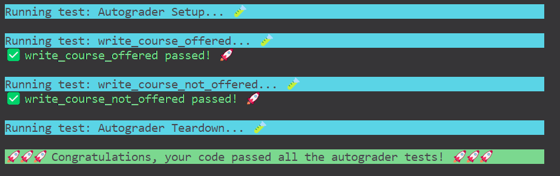

## 写在前面

本文取自Stanford CS106L的第一个作业，以下为笔者对本作业的思考以及对C++的一些思考。

CS106L作为C++的课程名不虚传，其特性只有自己写题时才能感知出来，一个简单的操作居然会有许多不同的方法来实现，笔者十分震惊，在这之前笔者对于C++仅是只闻其名，不闻其人。

关于此题，若你有有任何问题或更好的方法，欢迎与我联系。

[点这里向我发邮件](mailto:yutaki23@163.com)

## 具体思路

### Part 0: Read the code and fill in the `Course` struct

本题一共有两个任务

1. 整体看一下代码
2. 补充完整结构`Course`

首先观察一下整体代码，并说一下整个作业需要我们完成什么。本作业需要我们通过一个csv文件，来看看在一个特定的学期当中，有哪些课被学生选了并允许达到开课的要求，而有哪些课是没有被选的，在这里我们创建一个结构体`Course`其中包括三个参数，`title`课程名称、`number_of_units`此课程共有几个单元以及`quarter`学期，值得注意的是，国外学期用的是季节+年份来表示。

在下面有一个函数`parse_csv`即将一个csv文件转变为一个Course数组来存放。

还有`write_courses_offered`和`write_courses_not_offered`，分别代表将数组中的可以开课的课程存入一个csv文件和将数组中不可以开课的课程存入另一个csv文件当中。

下一部分看看结构体`Course`，观察题目给我们的csv文件可以发现，`title`和`quarter`均为字符串的形式，故它们的类型均为`String`，对于`number_of_units`笔者一开始认为其应该为`int`类型，但之后会用到一个`spilt`函数，其类型属于`String`，即将一个字符串分成好几个不同的字符串，故这里的`number_of_units`也应该为`String`类型，

```cpp
struct Course {
  std::string title;
  std::string number_of_units;
  std::string quarter;
};
```

接下来看代码中的注释，告诉我们看一下`main`函数，并告知我们这三个函数需要更改一下签名，观察可得，从始至终用的都是同一个结构体数组，而不是一直复制一个不断更改，故可以知道这里的数组应该是引用类型，即指向的是地址，改变一次，下一次也接着改变，故对于`parse_csv`函数来说需要将签名改为引用类型，而对于`write_courses_offered`函数来说，它存在特殊要求，最后是需要将参数数组在其原基础上做更改，所以也需要改为引用类型，对于`write_courses_not_offered`则没有这种要求，故不需要更改，

```cpp
void write_courses_offered(std::vector<Course>& all_courses)
void write_courses_not_offered(std::vector<Course> unlisted_courses)
```

### Part 1: `parse_csv`

本题需要我们完成`parse_csv`函数，此函数主要是读取一个csv文件的内容，并将其中的内容保存在一个`Course`数组中，简单思考一下，

1. 应该要使用IO流的方法来读取外部文件的内容，需要注意的是如何打开、关闭一个文件
2. 每一行都对应了一个`Course`故要一行一行的读取内容，在这里应使用`getline()`函数
3.  最上面一行的内容不属于`Course`应忽略，有多种方式可以忽略，如`ignore`函数，或仅读取却不做任何操作
4. 一行内容存放了三个不同的值，应使用`split`函数（应include此文件），对于此函数，其返回的是一个字符串数组，故可以使用[]表达式来取值
5. 关于如何对一个结构体数组添加元素，有许多方法可以做到，如`push_back`函数或`emplace_back`（这也是笔者对C++很震惊的一点，一个操作居然有如此多种方法可以实现）

故可以写出代码，

```cpp
void parse_csv(std::string filename, std::vector<Course>& courses) {
  std::ifstream inputFile;
  inputFile.open(filename);
  if (inputFile.is_open()) {
    std::string line;
    std::getline(inputFile, line);
    std::vector<std::string> splitString;

    while (std::getline(inputFile, line)) {
      splitString = split(line, ',');
      Course c;
      c.title = splitString[0];
      c.number_of_units = splitString[1];
      c.quarter = splitString[2];
      courses.push_back({c});
    }
  }
  inputFile.close();
}
```

### Part 2: `write_courses_offered`

本题需要将已经存在的一个`Course`数组进行筛选，选出`quarter`不为null的课程，写入一个新csv文件，并在最后将此存在的数组删除这些为null的课程，值得注意的点有，

1. 将数组中的内容写入文件中，应使用`ofstream`来做，记得打开文件也要关闭文件
2. 对于新csv文件的第一行会有一个特殊的内容需要单独写入
3. 需要记录下来哪些是需要删除的课程，并在最后使用题目给我们的`delete_elem_from_vector`函数来删除

故简单写出代码，

```cpp
void write_courses_offered(std::vector<Course>& all_courses) {
  std::ofstream outfile;
  outfile.open(COURSES_OFFERED_PATH);
      std::vector<Course> course_need_to_delete;

  if (outfile.is_open()) {
    outfile << "Title,Number of Units,Quarter" << std::endl;

    for (Course c: all_courses) {
      if (c.quarter != "null") {
        outfile << c.title << ',' << c.number_of_units << ',' << c.quarter << std::endl;
        course_need_to_delete.push_back({c});
      }
    }
  }
  outfile.close();
  for (auto& c : course_need_to_delete) {
    delete_elem_from_vector(all_courses, c);
  }
}
```

### Part 3: `write_courses_not_offered`

此题需要将一个已经存在的`Course`数组进行筛选，选出`quarter`为null的课程，写入一个新csv文件，但不需要删除，故大致部分与上文无二，还少了最后一个部分，不赘述，

```cpp
void write_courses_not_offered(std::vector<Course> unlisted_courses) {
  /* (STUDENT TODO) Your code goes here... */
  std::ofstream outfile;
  outfile.open(COURSES_NOT_OFFERED_PATH);
  if (outfile.is_open()) {
    outfile << "Title,Number of Units,Quarter" << std::endl;
    for (Course c : unlisted_courses) {
    outfile << c.title << ',' << c.number_of_units << ',' << c.quarter << std::endl;
    }
  }
  outfile.close();
}
```

### 常见问题

- 不要忘了将`main`函数的注释给删掉，才能进行autograde评分。笔者在这里起码缠了半个小时（要疯了）

