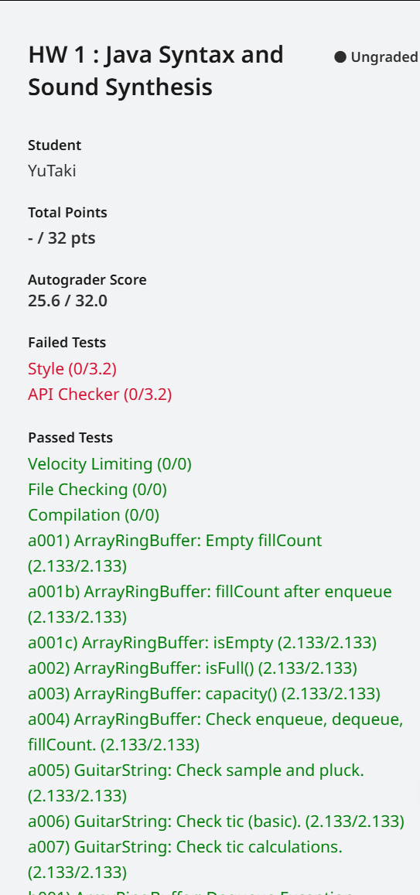

## 写在前面

本Homework取自UCB CS61B SP18的HW1。

本HW需要我们从十分底层开始一步一步抽象直到最后完成一个模拟音乐的程序，很好的锻炼了我们对于Java项目的组织能力与Java的特性如继承与多态等。

本文章为笔者在完成了所有任务后返回来写的，并非一步一步的思考，故少了许多碎碎念，多了一分严谨。但**是故弟子不必不如师，师不必贤与弟子**。若本文章存在错误或更好的想法，欢迎与我联系。

[点这里向我发邮箱~](mailto:yutaki23@163.com)

## 具体步骤

### Task1: BoundedQueue

本任务向我们介绍了接口的概念，并要求我们完成一个名为`BoundedQueue`的一个接口，对于接口，我们声明它使用`interface`关键字，接口不用实现具体方法，只需要给出具体有什么具体方法（除了`default`）即可。在这里还需要将此接口作为包的一部分存在，大部分内容在任务要求已经告诉我们了，故可得，

```java
package synthesizer;

public interface BoundedQueue<T> {
    /**
      * @return 返回buffer的size
     */
    int capacity();

    /**
     * @return 返回当前buffer内有多少个items
     */
    int fillCount();

    /**
     * @param x 将x添加到最后
     */
    void enqueue(T x);

    /**
     * @return 删除并返回第一个item
     */
    T dequeue();

    /**
     * @return 返回但不要删除第一个item
     */
    T peek();
}
```

本任务还要求我们完成两个`default`方法，十分显然，不赘述，具体可看我在下面写的注释，

```java
    /**
     * @return 若当前buffer为空则返回true，否则返回false
     */
    default boolean isEmpty() {
        return this.fillCount() == 0;
    }

    /**
     * @return 若当前buffer全满返回true，否则返回false
     */
    default boolean isFull() {
        return this.capacity() == this.fillCount();
    }
```

### Task 2: AbstractBoundedQueue

本任务要求我们实现一个继承上一个类的抽象类，即加上`abstract`与`implements`关键字，同时对于上文实现的两个`default`方法，需要在这里显式声明一下，并调用`super`方法其他跟着任务需求即可完成，

```java
package synthesizer;

public abstract class AbstractBoundedQueue<T> implements BoundedQueue<T> {
    protected int fillCount;
    protected int capacity;

    @Override
    public int capacity() {
        return this.capacity;
    }

    @Override
    public int fillCount() {
        return this.fillCount;
    }

    @Override
    public boolean isEmpty() {
        return BoundedQueue.super.isEmpty();
    }

    @Override
    public boolean isFull() {
        return BoundedQueue.super.isFull();
    }

    @Override
    public abstract T peek();

    @Override
    public abstract T dequeue();

    @Override
    public abstract void enqueue(T x);
}
```

### Task 3: ArrayRingBuffer

**本任务以类中TODO注释为顺序解释**

#### TODO1: Make sure to make this class a part of the synthesizer package

简单的显式声明一下属于这个包即可，

```java
package synthesizer;
```

#### TODO2: Make sure to make this class and all of its methods public

确保一下类与方法均为`public`，教授已经帮我们做过了。

#### TODO3: Make sure to make this class extend AbstractBoundedQueue< t >

这里改一下，t应该变成大写T，

```java
public class ArrayRingBuffer<T> extends AbstractBoundedQueue<T>
```

#### TODO4: `public ArrayRingBuffer(int capacity)`

在这里需要我们完成类的构造函数，根据要求具体需要

1. 创建一个泛型数组
2. 将`first` `last` `fillCount`均初始化为0
3. 显式将`capacity`声明一下

对于泛型数组的初始化，需要记住的是强制转换为我们需要的类型，

```java
    public ArrayRingBuffer(int capacity) {
        this.rb = (T[]) new Object[capacity];
        this.first = 0;
        this.last = 0;
        this.fillCount = 0;
        this.capacity = capacity;
    }
```

#### TODO5: `public void enqueue(T x)`

在开始这道题之前，需要先了解一下本任务中对队列的使用方法，我们可以将它简单想为一个循环数组，存在两个指针，`first`与`last`，初始值均为0，最大值可以到达此buffer的capacity。`enqueue`为在队列末尾添加一个元素，而每当我们添加一个元素时，就相当于在数组`last`的位置上添加了这个值，而此时`last`需要自增，值得注意的是，第一次添加的值的index并不一定是0，可以是任意小于capacity的值，故这里就需要我们考虑指针已经到达capacity了，但前面还没有被填满的情况，这里很想我们在proj1做过的循环头节点，只需要使用**取模**的方式就可以判断，那如何判断是否已经全部存储完了呢？只需要头指针与尾指针相等的情况下，就说明此时已经全部填完了，

```java
    public void enqueue(T x) {
        if (isFull()) {
            throw new RuntimeException("Ring buffer overflow");
        } else {
            rb[last] = x;
            fillCount++;
            last = (last + 1) % capacity;
        }
    }
```

#### TODO6: `public T dequeue()`

此题的大致内容与上题没什么两样，唯一值得注意的是，在取出队列的值时，是取出最前面的值，这也告诉我们，此时需要维护的是头指针，每去除一个值，头指针就需要自减一次，同样，也会存在到达0了但是后面还有内容没有取出来的情况，故还是需要用到**取模**，

```java
    public T dequeue() {
        if (isEmpty()) {
            throw new RuntimeException("Ring buffer underflow");
        } else {
            T result = rb[first];
            rb[first] = null;
            fillCount--;
            first = (first + 1) % capacity;
            return result;
        }
    }
```

#### TODO7: `public T peek()`

此题需要我们仅返回队列第一个的内容，但不删除，简单的数组操作，不赘述，

```java
    public T peek() {
        if (isEmpty()) {
            throw new RuntimeException("Ring buffer underflow");
        } else {
            return rb[first];
        }
    }
```

### Task 4: GuitarString

**本任务以TODO注释作为顺序来解答**

#### TODO1: Make sure to make this class a part of the synthesizer package

简单的声明包，不赘述，

```java
package synthesizer;
```

#### TODO2: `public GuitarString(double frequency)`

本题需要我们创建一个buffer，其capacity为一个特殊值，并将此buffer内的所有值初始化为0，简单的迭代，

```java
    public GuitarString(double frequency) {
        // TODO: Create a buffer with capacity = SR / frequency. You'll need to
        //       cast the result of this divsion operation into an int. For better
        //       accuracy, use the Math.round() function before casting.
        //       Your buffer should be initially filled with zeros.
        this.buffer = new ArrayRingBuffer<>((int) Math.round(SR / frequency));
        for (int i = 0; i < buffer.capacity(); i++) {
            buffer.enqueue(0.0);
        }
    }
```

#### TODO3: `public void pluck()`

本题需要我们将buffer内的值替换为一个[-0.5 - 0.5]的随机数，其中随机数必须每次都不一样，使用`Math.Random()`即可，简单的迭代，

```java
    public void pluck() {
        for (int i = 0; i < buffer.capacity(); i++) {
            double r = Math.random() - 0.5;
            buffer.dequeue();
            buffer.enqueue(r);
        }
    }
```

#### TODO4: `public void tic()`

本题需要我们以*Karplus-Algorithm*为参考，即将队列的前两个值求平均值并乘能量衰减因子，并将此值替换为队列的前一个值，故这里可以看出来，对于第一个值要取出并返回，第二个值只需要返回即可不需要取出，因此，

```java
    public void tic() {
        double firstItem = buffer.dequeue();
        double secondItem = buffer.peek();
        buffer.enqueue((firstItem + secondItem) * 0.5 * DECAY);
    }
```

#### TODO5: `public double sample()`

本题需要我们返回队列当中的第二个值，但不需要取出，

```java
    public double sample() {
        return buffer.peek();
    }
```

### Task 5: Iteration and Exceptions

#### BoundedQueue

修改类声明即可，不赘述

```java
public interface BoundedQueue<T> extends Iterable<T>
```

#### ArrayRingBuffer

此题需要我们对`iterator()`的方法进行重写，迭代器包含三个方法，构造函数、`hasNext()`和`next()`，根据Josh教授的提示可以知道，

`private RingBufferIterator()`只需要在这里添加一个计数器，以便之后判断是否到达边界即可。

`public boolean hasNext()`判断之后还有没有元素了，只需要判断此时的计数器是否到达了buffer中已有的元素数量。

`public T next()`求下一个元素的值，简单的数组操作。

```java
import java.util.Iterator;
	
	public Iterator<T> iterator() {
        return new RingBufferIterator();
    }

    private class RingBufferIterator implements Iterator<T> {
        private int current;
        private RingBufferIterator() {
            this.current = 0;
        }

        @Override
        public boolean hasNext() {
            return current != fillCount();
        }

        @Override
        public T next() {
            T item = rb[current];
            current++;
            return item;
        }
    }
```

#### Exceptions

上文已完成，不赘述。

**详细内容可以看我的[GitHub仓库](https://github.com/YuTaki23/CS61B-SP18/tree/main/hw1)**



关于这里的API Checker，若把关键字改为`private`则无法编译，故放弃。

## 写在后面

总的来说本HW并不难，大多数已经给出步骤，只需要简单翻译即可。