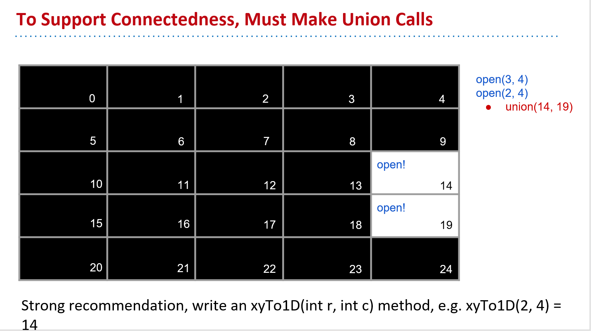
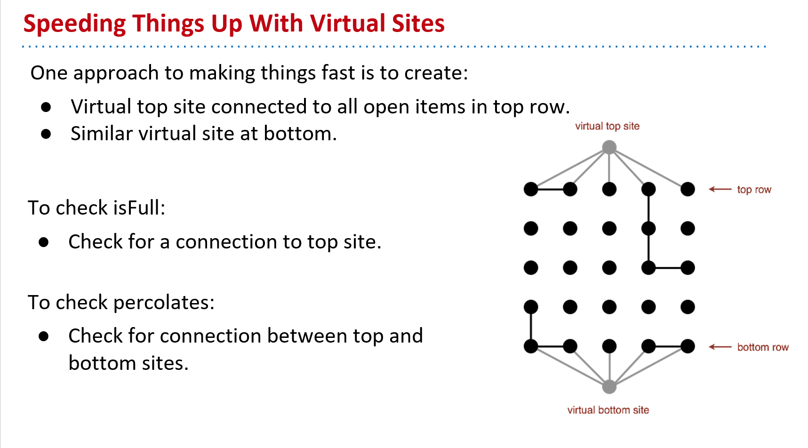
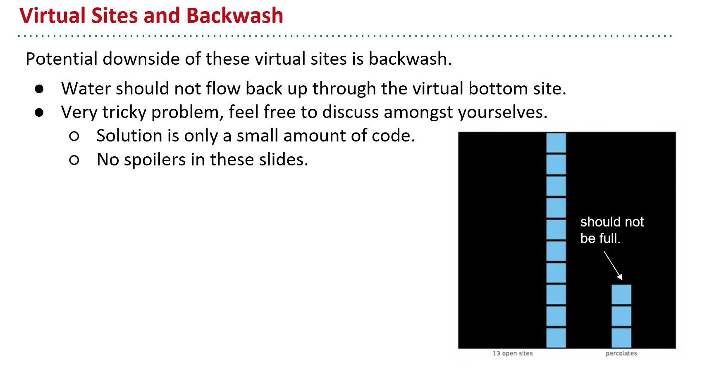
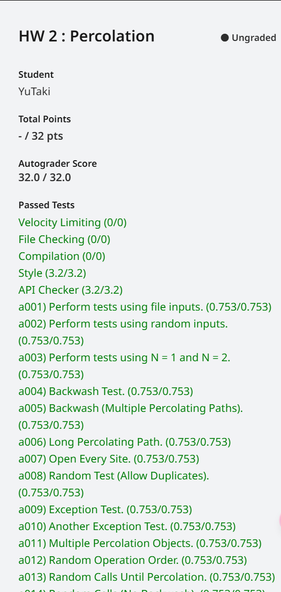

## 写在前面

本HW取自UCB CS61B SP18的HW2: Percolation。

主要内容为在给定数据结构的情况下，实现一个现实生活中的应用，很好的锻炼了我们对已有API情况下编写代码的能力。

本文为笔者参考了多方笔记所写，在此感谢所有付出的人，具体参考资料可看最后。

虽已完成，却仍有许多不解，若你有更好的想法或我需要改进的地方，望不吝赐教。

[点这里向我发邮件~](maiito:yutaki23@163.com)

## 具体思路

### 背景介绍

本HW需要我们使用不相交集的API通过Monte Carlo模拟来估计渗流阈值。

问：什么是渗流？

答：简单来说，可以想象一个竖着拜访的箱子，箱子内部有许多小箱子，在最开始它们全都是被锁上的，在最上方有水会流下来，我们需要不断打开小箱子，直到通过重力的作用，有一个完整的路径可以让水从最顶部流到最底部。

### Percolation.java

**此部分不会一开始就给出最终答案，而是会以笔者正常的思考一步一步完成最后的内容**

此类需要我们完成一个渗流模型程序，其中包括构造函数、打开一个箱子、整个系统是否渗流等操作。

#### `public Percolation(int N)`

根据题目描述，构造函数需要我们创建一个N * N的二维网格结构，且所有格子最开始都是锁上的。很容易想到这里需要让我们创建一个二维数组，但此二维数组的类型是什么呢？仔细想想，所有格子最开始是锁上的，是否可以将锁上与打开想象成`false`和`true`，因此我们就需要创建一个二维布尔数组。同时，题目给出要求构造函数所要求的时间为二次函数，满足。下方给出了一个极端情况，当N <= 0时应抛出异常，此时我们可以写出代码，

```java
public class Percolation {
    private boolean[][] grid;
    private int N;
    
    public Percolation(int N) {
        this.N = N;
        if (N <= 0) {
            throw new IllegalArgumentException();
        }

        this.grid = new boolean[N][N];
    }
```

#### `public void open(int row, int col)`

此方法需要我们完成打开箱子的操作，简单想想，我们之前把箱子抽象为布尔，那打开一个箱子是不是就是将`false`变为`true`，且需要满足此时这个箱子不是被打开的，简单做一个`if`判断即可，可以写出，

```java
    public void open(int row, int col) {
        if (row < 0 || row > N - 1 || col < 0 || col > N - 1) {
            throw new IndexOutOfBoundsException();
        } else {
            if (!grid[row][col]) {
                grid[row][col] = true;
            } else {
                return;
            }
        }
    }
```

#### `public boolean isOpen(int row, int col)`

此方法需要我们完成一个特定的箱子此时是否被打开的操作，一个箱子作为一个布尔值，只需要判断当前布尔值是多少即可，同时题目给出我们要求，若给定参数不合法应抛出异常，故可以写出，

```java
    public boolean isOpen(int row, int col) {
        if (row < 0 || row > N - 1 || col < 0 || col > N - 1) {
            throw new IndexOutOfBoundsException();
        }
        return grid[row][col];
    }
```

#### `public boolean isFull(int row, int col)`

此方法需要我们判断这个特定的箱子是否是“满”的，如何理解这个**Full**？根据Josh教授给出的提示，简单来说只要此时这个箱子与最上面一行的箱子中的任何其中一个相连，即视他为isFull，故我们只需要判断这个箱子是否与最上面的箱子之一相连即可，那么问题又来了，我该用什么来表示这个箱子与其他箱子相连呢？我们直到，这个特定的箱子不一定是第二行的，它可以是最后一行，可以是任何一行，所以我们还需要思考它怎么与其他任意一个箱子相连呢？因为我们知道对于两个不相邻的箱子来说，只要它们中间的箱子是打开的，那它们也算是相连的，这里就需要用到我们学习的不相交集的概念了。我们可以把整个二维数组想象成一个不相交集，每打开一个箱子，我们就会将其添加进去。思路明确，想想第一步应该做什么，首先应该创建一个不相交集，故我们可以在构造函数中添加，

```java
public class Percolation {
    private boolean[][] grid;
    private int N;
    private WeightedQuickUnionUF wquuf;
    
    public Percolation(int N) {
        this.N = N;
        if (N <= 0) {
            throw new IllegalArgumentException();
        }

        this.grid = new boolean[N][N];
        this.wquuf = new WeightedQuickUnionUF(N * N);
    }
}
```

有了不相交集，我们就应该判断一个箱子是否与另一个箱子相连，在这里应该是在`open`方法中添加，每当我们打开一个箱子后，就要在不相交集中添加一个元素，查看不相交集的API，可以发现`union(int p, int q)`方法是很符合我们所想要的内容的，但我们仔细观察一下，这里的参数需要的是两个整型，我们表示一个箱子用的是一个数组，很明显不符，因此我们就需要把每个箱子添加一个唯一的index，根据Josh教授的提示，我们可以看出，



需要添加一个特定的方法`xyTo1D`将一个以xy表示的数组创建一个特定的index，这个方法很好写，仔细观察就可以看出来，

```java
    private int xyTo1D(int row, int col) {
        return row * N + col;
    }
```

有了这个方法我们就可以把每个数组连接起来了，在这里，一个箱子是会与四周的任意一个箱子连接的，故会有四种可能，其中，每个边界如上边指挥与左下右相连，而不会与上方再次相连了，因为他们之间已经没有东西了，故可以写出，

```java
    public void open(int row, int col) {
        if (row < 0 || row > N - 1 || col < 0 || col > N - 1) {
            throw new IndexOutOfBoundsException();
        } else {
            if (!grid[row][col]) {
                grid[row][col] = true;
                openSiteSum++;
            } else {
                return;
            }
        }

        int index = xyTo1D(row, col);
        // 现开始考虑四周如果是打开的情况，与之相连
        // 上边，原节点至少是第二行
        if (row > 0 && isOpen(row - 1, col)) {
            wquuf.union(xyTo1D(row - 1, col), index);
        }
        // 下边，原节点至多是倒数第二行
        if (row < N - 1 && isOpen(row + 1, col)) {
            wquuf.union(xyTo1D(row + 1, col), index);
        }
        // 左边，至少是第二列
        if (col > 0 && isOpen(row, col - 1)) {
            wquuf.union(xyTo1D(row, col - 1), index);
        }
        // 右边，至多是倒数第二列
        if (col < N - 1 && isOpen(row, col + 1)) {
            wquuf.union(xyTo1D(row, col + 1), index);
        }
    }
```

现在我们已经完成了箱子与箱子之间相连的部分了，该相信`isFull`该怎么完成了，根据上文可知，这个就是判断这个特定的箱子是否与最上方的任意一个箱子所连接，故我们可以写出代码，

```java
    public boolean isFull(int row, int col) {
        if (row < 0 || row > N - 1 || col < 0 || col > N - 1) {
            throw new IndexOutOfBoundsException();
        }
        int index = xyTo1D(row, col);
        for (int i = 0; i < N; i++) {
            if (wquuf.connecter(index, xyTo1D(0, i))) {
                return true;
            } else {
                return false;
            }
        }
    }
```

但是我们可以发现，这需要我们判断上面每一个箱子，这属于线性时间，不符合题目所要求的常数时间，所以此方法不可取，还需寻找其他方法，根据Josh教授给出的提示，



我们可以在上下两部分都给出一个虚拟箱子，并让上虚拟箱子与第一行的相连，让下虚拟仙子与最后一行相连，只要上虚拟箱子与特定箱子相连，即表示Full，故可以写出代码，

```java
public class Percolation {
    private boolean[][] grid;
    private int N;
    private WeightedQuickUnionUF wquuf;
    private int virtualTopSite;
    private int virtualBottomSite;
    
    public Percolation(int N) {
        this.N = N;
        if (N <= 0) {
            throw new IllegalArgumentException();
        }

        this.grid = new boolean[N][N];
        this.wquuf = new WeightedQuickUnionUF(N * N + 2);
        this.virtualTopSite = N * N;
        this.virtualBottomSite = N * N + 1;
    }
    
    public void open(int row, int col) {
        // 前省略
        int index = xyTo1D(row, col);
        // 将上方的虚拟节点连接到第一行
        if (row == 0) {
            wquuf.union(virtualTopSite, index);
        }
        // 将下方的虚拟节点连接到最后一行
        if (row == N - 1) {
            wquuf.union(virtualBottomSite, index);
        }
        // 后省略
    }
    
    public boolean isFull(int row, int col) {
        if (row < 0 || row > N - 1 || col < 0 || col > N - 1) {
            throw new IndexOutOfBoundsException();
        }
        int index = xyTo1D(row, col);
        return wquuf.connected(index, virtualTopSite);
    }
}
```

在这里值得注意的是，我们需要事先给两虚拟箱子分配一个值，但不能是负值（笔者在这里就错过），不仅如此还要将不相交集多分配两个以便存放虚拟箱子。

#### `public int numberOfOpenSites()`

此方法需要我们给出目前有多少个打开的箱子，很容易实现，就像之前的size一样，只要在每次打开一个箱子后加一即可，

```java
public class Percolation {
    // 前省略
    private int openSiteSum;
    
    public Percolation(int N) {
        // 前省略
        this.openSiteSum = 0;
    }
    
    public void open(int row, int col) {
        if (row < 0 || row > N - 1 || col < 0 || col > N - 1) {
            throw new IndexOutOfBoundsException();
        } else {
            if (!grid[row][col]) {
                grid[row][col] = true;
                openSiteSum++;
            } else {
                return;
            }
        }
        // 后省略
        
    public int numberOfOpenSites() {
        return openSiteSum;
    }
}
```

#### `public boolean percolates()`

此方法需要我们判断此系统是否已经渗流，可以想到，一个系统渗流，就代表其最上方与最下方相连，再根据我们之前所创建的虚拟箱子，很容易写出，

```java
    public boolean percolates() {
        return wquuf.connected(virtualTopSite, virtualBottomSite);
    }
```

但是在这里会出现一个问题，Josh教授给我们指出来了，



当已存在一个渗流，另一个不满足渗流标准时，就会出现问题，故在这里我们就需要创建一个新的不相交集，此不相交集仅保存上虚拟箱子，而不保存下虚拟箱子，这样在判断`isFull`的时候就不会有问题了，

```java
public class Percolation {
    // 前省略
    private WeightedQuickUnionUF wquufWithBackWash;
    //后省略
    
    public Percolation(int N) {
    	// 前省略
        this.wquufWithBackWash = new WeightedQuickUnionUF(N * N + 1);
    }
    
    public void open(int row, int col) {
        if (row < 0 || row > N - 1 || col < 0 || col > N - 1) {
            throw new IndexOutOfBoundsException();
        } else {
            if (!grid[row][col]) {
                grid[row][col] = true;
                openSiteSum++;
            } else {
                return;
            }
        }

        int index = xyTo1D(row, col);
        // 将上方的虚拟节点连接到第一行
        if (row == 0) {
            wquuf.union(virtualTopSite, index);
            wquufWithBackWash.union(virtualTopSite, index);
        }
        // 将下方的虚拟节点连接到最后一行
        if (row == N - 1) {
            wquuf.union(virtualBottomSite, index);
        }
        // 现开始考虑四周如果是打开的情况，与之相连
        // 上边，原节点至少是第二行
        if (row > 0 && isOpen(row - 1, col)) {
            wquuf.union(xyTo1D(row - 1, col), index);
            wquufWithBackWash.union(xyTo1D(row - 1, col), index);
        }
        // 下边，原节点至多是倒数第二行
        if (row < N - 1 && isOpen(row + 1, col)) {
            wquuf.union(xyTo1D(row + 1, col), index);
            wquufWithBackWash.union(xyTo1D(row + 1, col), index);
        }
        // 左边，至少是第二列
        if (col > 0 && isOpen(row, col - 1)) {
            wquuf.union(xyTo1D(row, col - 1), index);
            wquufWithBackWash.union(xyTo1D(row, col - 1), index);
        }
        // 右边，至多是倒数第二列
        if (col < N - 1 && isOpen(row, col + 1)) {
            wquuf.union(xyTo1D(row, col + 1), index);
            wquufWithBackWash.union(xyTo1D(row, col + 1), index);
        }
    }
    
    public boolean isFull(int row, int col) {
        if (row < 0 || row > N - 1 || col < 0 || col > N - 1) {
            throw new IndexOutOfBoundsException();
        }
        int index = xyTo1D(row, col);
        return wquufWithBackWash.connected(index, virtualTopSite);
    }
}
```

#### `public static void main(String[] args)`

关于这个main方法，大家可以写一些自己的测试，但不要删掉也不要不写，否则autograde过不去。

### PercolationStats.java

在此类，就需要我们完成Mento Carol模拟了，具体步骤可以看题目描述，在此不赘述。

**本类一样不会直接给出答案，而是会一步步思考**

#### `public PercolationStats(int N, int T, PercolationFactory pf)`

此构造函数需要我们在N * N的二维数组下完成T次Mento Carol模拟，故我们就需要在这里完成整个模拟过程，而不需要再创建一个其他方法或其他。

首先看模拟第一步，初始化所有sites并将其设为关闭状态。这就是用我们上文完成的渗流模型即可，值得注意的是，这里参数并没有给我们上文完成的类，而是给了另一个类似于中转站的类，不过也没关系，简单new即可，

```java
public class PercolationStats {
    private int N;
    private int T;
    private Percolation p;
    
    public PercolationStats(int N, int T, PercolationFactory pf) {
        this.N = N;
        this.T = T;
        if (N <= 0 || T <= 0) {
            throw new IllegalArgumentException();
        }
        this.threshold = new double[T];

        for (int i = 0; i < T; i++) {
            // 初始化site，全为blocked
            this.p = pf.make(N);
        }
    }
```

第二步，重复操作，意味着需要循环，

- 在所有关闭的site随机选择一个site，意味着需要使用random函数
- 打开这个site
- 当渗流完成时，将其比例添加至渗流阈值，意味着我们需要知道公式，以及创建一个新数组

详情可以看题目描述，简单写出代码，

```java
public class PercolationStats {
    private int N;
    private int T;
    private double[] threshold;
    private Percolation p;

    public PercolationStats(int N, int T, PercolationFactory pf) {
        this.N = N;
        this.T = T;
        if (N <= 0 || T <= 0) {
            throw new IllegalArgumentException();
        }
        this.threshold = new double[T];

        for (int i = 0; i < T; i++) {
            // 初始化site，全为blocked
            this.p = pf.make(N);
            while (!p.percolates()) {
                // 随机打开一个site
                int randomRow = StdRandom.uniform(N);
                int randomCol = StdRandom.uniform(N);
                p.open(randomRow, randomCol);
            }
            threshold[i] = (double) p.numberOfOpenSites() / (N * N);
        }
    }
}
```

#### `public double mean()`

此方法需要我们完成渗流阈值样本平均值，题目给出我们提示使用StdStats库即可，里面有求样本平均值的函数，

```java
    public double mean() {
        return StdStats.mean(threshold);
    }
```

#### `public double stddev()`

此方法与上题一样，求渗流阈值的样本标准差，

```java
    public double stddev() {
        return StdStats.stddev(threshold);
    }
```

#### `public double confidenceLow()`

此方法求置信区间的左边界，公式题目已写，简单翻译即可，

```java
    public double confidenceLow() {
        return mean() - ((1.96 * stddev()) / Math.sqrt(T));
    }
```

#### `public double confidenceHigh()`

此题与上题别无二致，不赘述，

```java
    public double confidenceHigh() {
        return mean() + ((1.96 * stddev()) / Math.sqrt(T));
    }
```

至此，所有内容均已完成，可以用模拟来看看自己的程序是否对，也可以看看教授给出的模拟后的样子。

详细内容可以看我的[GitHub仓库](https://github.com/YuTaki23/CS61B-SP18/tree/main/hw2)



## 写在后面

本HW一开始确实很难想到，看了Josh教授的提示才能写个七七八八，不过总体来说不难。

## 参考资料

[「CS61B」Note(1) HW2 Percolation](https://pricezhang42.github.io/2021/10/08/CS61B-HW2.html)

[CS61B 算法作业：Percolation（蒙特卡洛渗流模拟）的Java 实现](https://zhuanlan.zhihu.com/p/8740935104)

[cs61b实验记录（四）HW2，lab9](https://blog.csdn.net/qq_45698833/article/details/115436385)