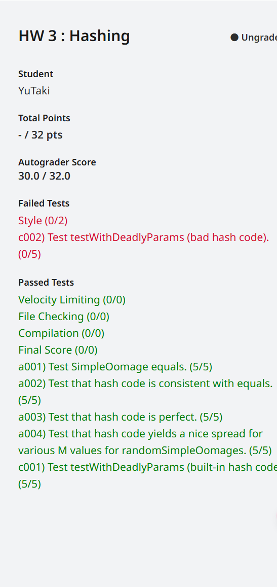

# HW3: Hashing
## 具体思路
### Simple Oomage
首先观察一下这个类，存在三个实例变量，red、blue和green，只要这三个值在0-255之间并且是5的倍数，就称为有效。
#### equals
普通的`equals`只是检查目标地址是否相同，若相同则返回true，反之false，但在这里不可行。同时还应注意的是为了保证比较的两个类是完全相同的两个类，而不是子类或其他，应使用`getClass`方法来判断，观察`Date`类的`equals`方法可模仿写出代码，
```java
    @Override
    public boolean equals(Object o) {
        if (o == this) {
            return true;
        }
        if (o == null) {
            return false;
        }
        if (o.getClass() != this.getClass()) {
            return false;
        }
        SimpleOomage that = (SimpleOomage) o;
        return (this.red == that.red) && (this.green == that.green) && (this.blue == that.blue);
    }
```
#### A Simple hashCode
此题需要我们完成一个哈希函数，作为一个好的哈希函数，应该要做到能平均的放到每一个哈希表中，不会出现一组数据只放在一个哈希表内，对于题目给我们的数可知，这三个数均为0-255之间且为5的倍数的数字，那么一组数最多只有52个数字（0-51），因此我们可以从这两个地方入手，写出
```java
@Override  
public int hashCode() {  
    if (!USE_PERFECT_HASH) {  
        return red + green + blue;  
    } else {  
        // Write a perfect hash function for Simple Oomages.  
        int rIndex = red / 5;  
        int gIndex = green / 5;  
        int bIndex = blue / 5;  
        return rIndex * 52 * 52 + gIndex * 52 + bIndex;  
    }  
}
```
#### testHashCodePerfect
本体需要我们编写一个测试，来测试目前给的哈希函数是错误的，先观察一下当前的哈希函数，这只是简单的将三个数字相加，没有做任何区分，可以想到，若把数字交换一下，这同样也会给出一样的值，但从本质上来说，它们是不同的，可以写出
```java
@Test  
public void testHashCodePerfect() {    
	SimpleOomage ooA = new SimpleOomage(5, 10, 20);  
    SimpleOomage ooA2 = new SimpleOomage(10, 20, 5);  
    assertNotEquals(ooA.hashCode(), ooA2.hashCode());
```
#### A Perfect hashCode
将`USE_PERFECT_HASH`改为`true`即可
```java
private static final boolean USE_PERFECT_HASH = true;
```
