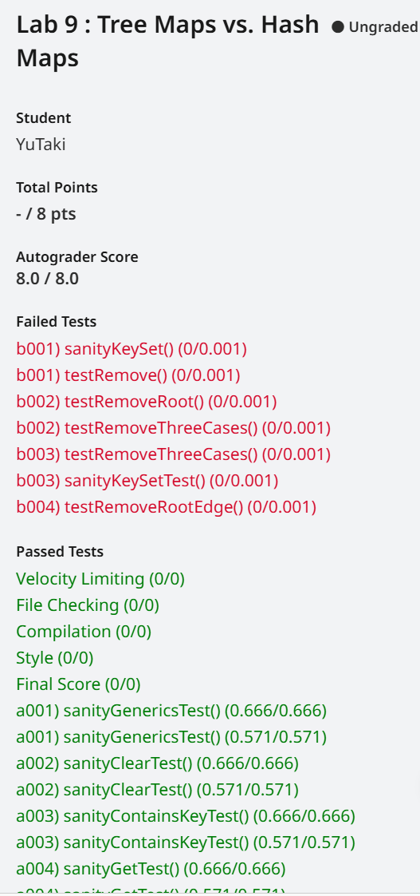

## 写在前面

本lab取自UCB CS61B SP18 Lab9，具体内容为使用二叉搜索树和哈希表实现map。

若本文存在错误或有更好的想法，欢迎与我联系。

[点这里向我发邮件](mailto:yutaki23@163.com)

## 具体思路

### BSTMap

#### 概念回顾

首先回忆一下什么是BST。对于一棵树来说，存在

- 一系列节点
- 一系列用来连接这些节点的边（对于任意两个节点仅有一条边来连接）

对于一个存在根节点的树来说，我们称一个节点就是一棵树

- 每个节点都存在一个父节点（除根节点以外）
- 一个没有子节点的节点称为叶子

对于一个二叉树，每个节点存在0、1或2个节点（子树）

对于一个二叉搜索树，要将搜索的概念引入二叉树中，左边的节点总是要小于右边的，右边的节点总是要大于左边的，中间的节点总是在其中间存在。

#### `get`

对于此方法，我们要递归的找到需要的值，基本思路为若目标值小于当前节点，则往左树寻找，若大于当前节点，则往右数寻找，若等于当前节点，则返回。

值得注意的是，对于key的比较，应使用Java提供的`compareTo`方法，这可以让我们比较其他类型的值。简单写出代码，

```java
    private V getHelper(K key, Node p) {
        if (p == null) {
            return null;
        }
        int cmp = key.compareTo(p.key);
        if (cmp < 0) {
            return getHelper(key, p.left);
        } else if (cmp > 0) {
            return getHelper(key, p.right);
        } else {
            return p.value;
        }
    }

    public V get(K key) {
        return getHelper(key, root);
    }
```

#### `put`

对于此方法，与上方法大差不差，总体思路还是比较目标值与当前值的大小，分三种情况讨论即可，

```java
    private Node putHelper(K key, V value, Node p) {
        // if found, do nothing
        if (p == null) {
            return new Node(key, value);
        }
        // if not found, create a new node,
        int cmp = key.compareTo(p.key);
        if (cmp < 0) {
            p.left = putHelper(key, value, p.left);
        } else if (cmp > 0) {
            p.right = putHelper(key, value, p.right);
        } else {
            p.value = value;
        }
        return p;
    }

    public void put(K key, V value) {
        root = putHelper(key, value, root);
        size++;
    }
```

#### `size`

在`put`内添加一个变量，每put一个值，size就自增即可，

```java
    public int size() {
        return size;
    }
```

### MyHashMap

对于本类，并没有用太多HashTable的底层实现，不过在此，笔者还是想写下一些自己的回顾，以便之后复习。

对于一个哈希表来说，值得注意的是哈希函数与当前数组存放满之后链表的存放方法，对于哈希函数，每个不同的数据存在不同的哈希函数，但正如algs4所说，创造一个性能好的哈希函数是前沿计算机科学家需要做的事情，我能做的只有站在巨人的肩膀上使用它们。对于拉链法，即当当前数组存放满之后，要在数组之后引入一个指针指向一系列链表，十分巧妙，很好的将内存与时间平衡了起来。

#### `get`

此方法与数组访问元素的方法很像，不同的是，此时的索引应使用哈希函数来变换一下，

```java
    public V get(K key) {
        if (key == null) {
            return null;
        } else {
            return buckets[hash(key)].get(key);
        }
    }
```

#### `put`

此方法与数组存放元素的方法也很想，不同的是，一个数组的内存总是有限的，若链表的长度过长，时间上也会有损伤，故需要扩大数组 ，很想之前实现过的ArrayDequeue，应实现一个`resize`方法，简单思路为创建一个新数组，将数组大小扩大，并将原数组的元素存放进去即可，

```java
    private MyHashMap(int cap) {
        buckets = new ArrayMap[cap];
        this.clear();
    }

    private void resize(int cap) {
        MyHashMap<K, V> resizeBucket = new MyHashMap<>(cap);
        for (int i = 0; i < buckets.length; i++) {
            for (K key : buckets[i].keySet()) {
                resizeBucket.put(key, buckets[i].get(key));
            }
        }
        this.size = resizeBucket.size;
        this.buckets = resizeBucket.buckets;
    }

    public void put(K key, V value) {
        if (loadFactor() > MAX_LF) {
            resize(2 * buckets.length);
        }
        if (!containsKey(key)) {
            size++;
        }
        buckets[hash(key)].put(key, value);
    }
```

#### `size`

与上文相同，不赘述，

```java
    public int size() {
        return size;
    }
```



[点这里看完整代码实现](https://github.com/YuTaki23/CS61B-SP18/tree/main/lab9)