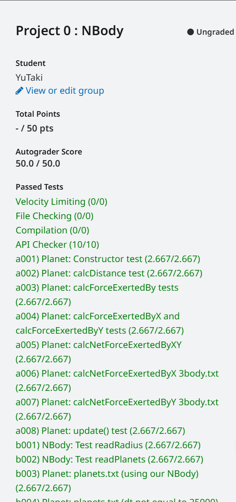

## 写在前面

本项目取自 **UCB CS61B SP18**的Project0: NBody Simulation。作为CS61系列的第二门课，专注于数据结构与算法，本项目只是对**Java**有了个简单的认识。以下为笔者做题时的心得体会，如有错误或更好的想法，欢迎与我联系。

[点这里向我发邮件~](mailto:yutaki23@163.com)

## 具体实现

###The Planet Class and Its Constructor

这道题让我们了解了`Planet`这个类具体代表什么，存在哪些参数，还需要创建两个构造函数，两个拥有不同参数的构造函数。

1. 创建实例变量。在这个类里面按照题目要求一步一步写即可。
2. 创建构造函数1。这个构造函数存在六个不同的参数，按照题目要求写好签名，在构造函数内部使用`this`即可完成。
3. 创建构造函数2.这个构造函数存在一个参数，即一个已被实例化的`Planet`，需要将此`Planet`复制到新`Planet`中，使用`this`与`p.`点表达式即可完成。

```java
public class Planet {
    public double xxPos;
    public double yyPos;
    public double xxVel;
    public double yyVel;
    public double mass;
    public String imgFileName;

    public Planet(double xP, double yP, double xV, double yV, double m, String img) {
        this.xxPos = xP;
        this.yyPos = yP;
        this.xxVel = xV;
        this.yyVel = yV;
        this.mass = m;
        this.imgFileName = img;
    }

    public Planet(Planet p) {
        this.xxPos = p.xxPos;
        this.yyPos = p.yyPos;
        this.xxVel = p.xxVel;
        this.yyVel = p.yyVel;
        this.mass = p.mass;
        this.imgFileName = p.imgFileName;
    }
}
```

### Understanding the Physics

在这里题目向我们介绍了此项目用到的物理知识，都是简单的高中物理知识，我在这里简单说一下。

1. 万有引力公式。两个粒子之间存在相互吸引的力，大小为$F = \dfrac{G \cdot m_1 \cdot m_2}{r^2}$，方向指向对方。
2. 勾股定理。$r^2 = dx^2 + dy^2$。
3. 在x轴上的力。$F_x = \dfrac{F \cdot dx}{r}$。
4. 在y轴上的力。$F_y = \dfrac{F \cdot dy}{r}$。
5. 合外力。即同一方向上的力的和。
6. 加速度。$a_x = \dfrac{F_x}{m}$ $a_y = \dfrac{F_y}{m}$。

### Writing the Planet Class

#### calcDistance

此方法需要我们计算两行星之间的距离，运用勾股定理即可，值得注意的是，此题需要我们在一个`Planet`上使用点表达式来对另一个行星求解，也就是说，此题无法用`static`关键字。

```java
    public double calcDistance(Planet p) {
        double x1 = this.xxPos;
        double y1 = this.yyPos;
        double x2 = p.xxPos;
        double y2 = p.yyPos;

        double xAbs = Math.abs(x1 - x2);
        double yAbs = Math.abs(y1 - y2);
        return Math.sqrt((xAbs * xAbs) + (yAbs * yAbs));
    }
```

#### clacForceExertedBy

此方法需要我们计算两行星之间的万有引力，运用上文提到的万有引力公式即可，值得注意的是，此题向我们介绍了一个新的语法`static final`也即常量，同时也介绍了科学计数法的写法。在这里我们可以将万有引力常数**G**用科学计数法设为常量。

```java
    private static final double G = 6.67e-11;
    public double calcForceExertedBy(Planet p) {
        double radiusSquare = this.calcDistance(p) * this.calcDistance(p);
        return (G * this.mass * p.mass) / radiusSquare;
    }
```

#### calcForceExertedByX and calcForceExertedByY

此方法需要我们计算两行星之间在x轴方向与在y轴方向上的力，用到的公式即为上文中的3 4两条，值得注意的是，在计算两行星之间的位移差时要注意哪个在前哪个在后。

```java
    public double calcForceExertedByX(Planet p) {
        double distanceX = p.xxPos - this.xxPos;
        double force = this.calcForceExertedBy(p);
        double radius = this.calcDistance(p);
        return (force * distanceX) / radius;
    }

    public double calcForceExertedByY(Planet p) {
        double distanceY = p.yyPos - this.yyPos;
        double force = this.calcForceExertedBy(p);
        double radius = this.calcDistance(p);
        return (force * distanceY) / radius;
    }
```

#### calcNetForceExertedByX and calcNetForceExertedByY

此方法需要我们完成一系列行星对一个行星所施加的x轴与y轴方向的合分力（不知道也没有这个东西），值得注意的是，可以用到`enhanced for`来锻炼自己，以及`continue`用法。

```java
    public double calcNetForceExertedByX(Planet[] planets) {
        double sumForce = 0;
        for (Planet p : planets) {
            if (this.equals(p)) {
                continue;
            } else {
                sumForce += this.calcForceExertedByX(p);
            }
        }
        return sumForce;
    }

    public double calcNetForceExertedByY(Planet[] planets) {
        double sumForce = 0;
        for (Planet p : planets) {
            if (this.equals(p)) {
                continue;
            } else {
                sumForce += this.calcForceExertedByY(p);
            }
        }
        return sumForce;
    }
```

#### update

此方法需要我们计算经过一系列力之后，行星最终会到什么地方去，看着题目很长，实际上很简单，跟着题目给的步骤一步一步做即可，值得注意的是，此题不需要返回任何东西，只是在目前行星更新自己。

```java
    public void update(double dt, double fX, double fY) {
        double accelerationX = fX / this.mass;
        double accelerationY = fY / this.mass;

        this.xxVel += dt * accelerationX;
        this.yyVel += dt * accelerationY;

        this.xxPos += dt * this.xxVel;
        this.yyPos += dt * this.yyVel;
    }
```

### Getting Started with the Simulator (NBody.java)

#### ReadRadius

此题需要我们读取一个文件中的半径，根据题目可知，半径在一个文件中的第二位，以`double`形式存储。观察`BasicInDemo.java`不难发现，对于`In`这个类来说，是按顺序来查找文件中的每个变量，并且要以符合的形式来控制，值得注意的是，在这里要加上`static`关键字，综上易得。

```java
    public static double readRadius(String filename) {
        In in = new In(filename);
        int firstItemInFile = in.readInt();
        return in.readDouble();
    }
```

#### ReadPlanets

此题与上题类似，需要我们用`In`来不断读取内容，得到`Planet`的全部内容，并将其实例化为一个新的`Planet`，这里会用到`Planet`的构造函数1，可以得到，

```java
    public static Planet[] readPlanets(String filename) {
        In in = new In(filename);
        int totalPlanets = in.readInt();
        Planet[] planets = new Planet[totalPlanets];
        double radius = in.readDouble();

        for (int i = 0; i < totalPlanets; i++) {
            double xP = in.readDouble();
            double yP = in.readDouble();
            double xV = in.readDouble();
            double yV = in.readDouble();
            double m = in.readDouble();
            String img = in.readString();
            planets[i] = new Planet(xP, yP, xV, yV, m, img);
        }
        return planets;
    }
```

### Drawing the Initial Universe State (main)

#### Collecting All Needed Input

跟着步骤一步一步来即可，很容易。

```java
    public static void main(String[] args) {
        String TString = args[0];
        String dtString = args[1];
        String filename = args[2];
        double T = Double.parseDouble(TString);
        double dt = Double.parseDouble(dtString);
        Planet[] planets = readPlanets(filename);
        double radius = readRadius(filename);   
    }
```

#### Drawing the Background

观察`StdDrawDemo.java`即可知道如何创建`scale`与`background`，跟着Demo走即可。

```java
    private static final String imgPath = "images/starfield.jpg";

        StdDraw.setScale(-radius, radius);
        StdDraw.clear();
        StdDraw.picture(0, 0, imgPath);
        StdDraw.show();
```

#### Drawing One Planet

使用`StdDraw.picture()`即可，题目要求在行星自己的位置上画自己，即`xxPos`与`yyPos`和`imgFileName`.

```java
    public void draw() {
        StdDraw.picture(xxPos, yyPos, "images/" + imgFileName);
    }
```

#### Drawing All of the Planets

简单的迭代

```java
        for (Planet planet : planets) {
            planet.draw();
        }
```

### Creating an Animation

步骤都给出来了，写到后面也累了，大家自己看看吧（逃）。

```java
        StdDraw.enableDoubleBuffering();
        double time = 0;
        while (time < T) {
            double[] xForces = new double[planets.length];
            double[] yForces = new double[planets.length];
            for (int i = 0; i < planets.length; i++) {
                xForces[i] = planets[i].calcNetForceExertedByX(planets);
                yForces[i] = planets[i].calcNetForceExertedByY(planets);
            }
            for (int j = 0; j < planets.length; j++) {
                planets[j].update(dt, xForces[j], yForces[j]);
            }
            StdDraw.clear();
            StdDraw.picture(0, 0, imgPath);
            for (Planet planet : planets) {
                planet.draw();
            }
            StdDraw.show();
            StdDraw.pause(10);
            time += dt;
```



## 写在后面

本项目已完成，用时大约四小时，当然这也不是我第一次做:( ，作为第二个复习课程的第一个项目，整体难度并不大，大部分代码框架与提示都已给出，跟着题目走即可。

[点这里查看GitHub代码](https://github.com/YuTaki23/CS61B-SP18/tree/main/proj0)