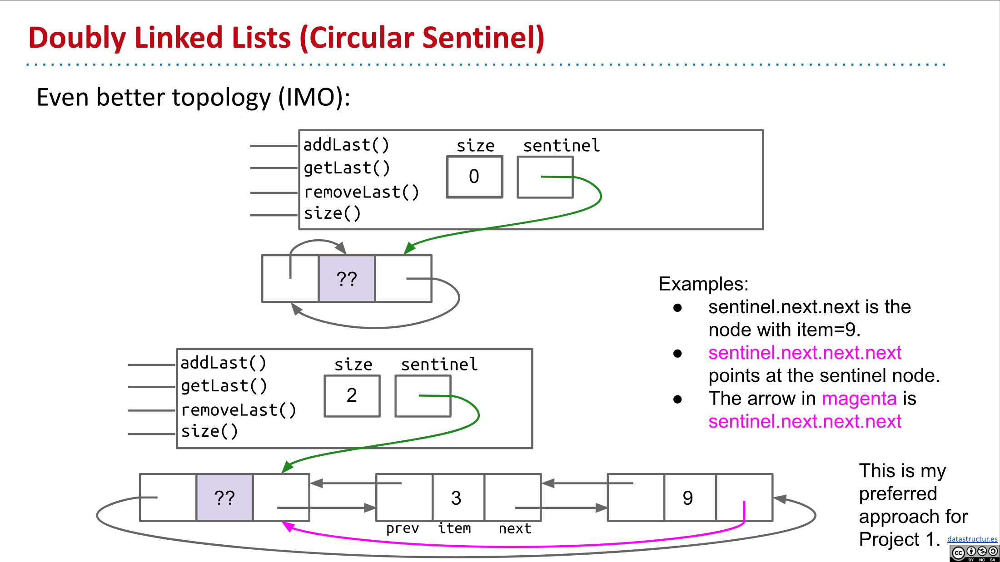
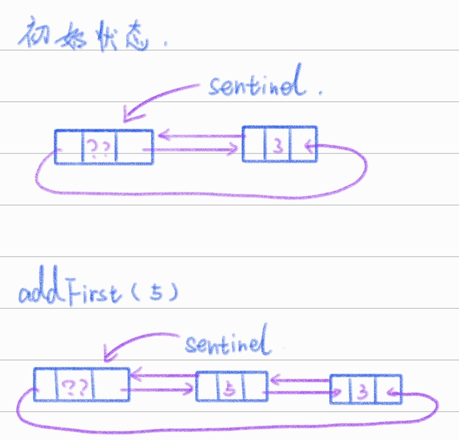
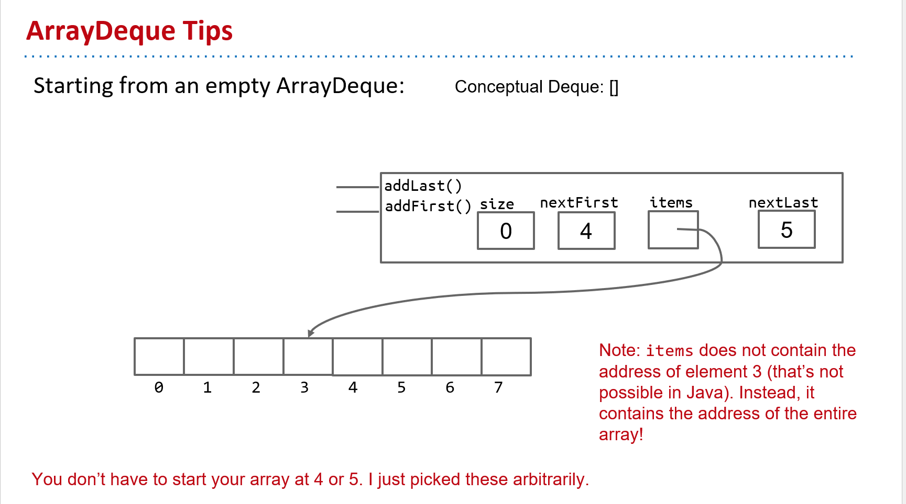
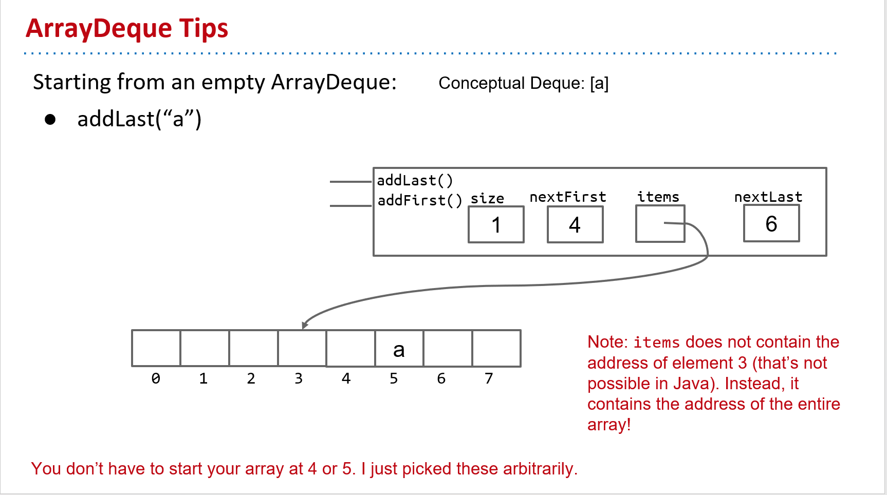
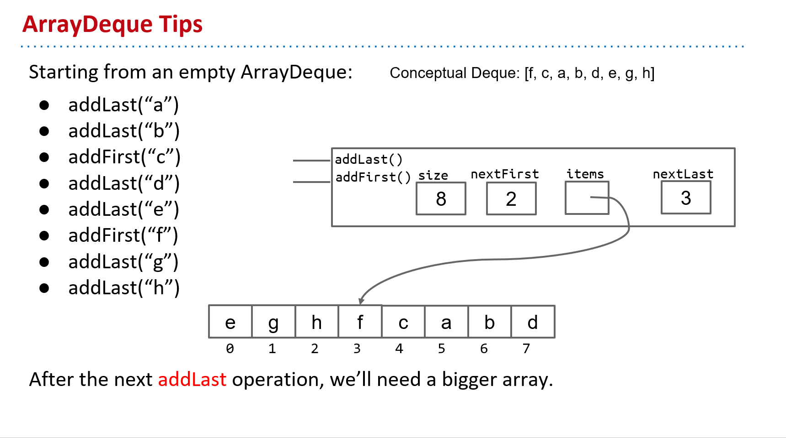
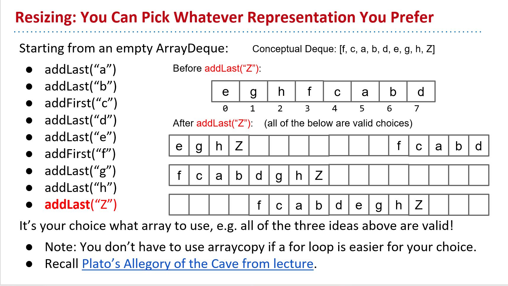

# [YuTaki] CS61B SP18 Project1A: Data Structure

## 写在前面

本项目取自CS61B SP18的Project1A，仅为个人做题时的思路及想法，如果有更好的想法，欢迎与我联系。

[点这里向我发邮件](mailto:yutaki23@163.com)

## 具体思路

### LinkedListDeque

#### `public LinkedListDeque()`

在最开始初始化链表时，大家就应该把思路理清楚。Josh教授在LinkedListDeque这一部分推荐我们使用两个方法来实现，第一个是[two sentinel topology](https://docs.google.com/presentation/d/1suIeJ1SIGxoNDT8enLwsSrMxcw4JTvJBsMcdARpqQCk/pub?start=false&loop=false&delayms=3000&slide=id.g829fe3f43_0_291)，第二个是[circular sentinel topology](https://docs.google.com/presentation/d/1suIeJ1SIGxoNDT8enLwsSrMxcw4JTvJBsMcdARpqQCk/pub?start=false&loop=false&delayms=3000&slide=id.g829fe3f43_0_376)，在这里笔者使用的方法是第二个也是Josh教授推荐我们使用的方法。



首先大家先看看上半部分，是初始化链表很重要的一部分，我们可以看出来，在这个类中，存在两个实例变量`size`和`sentinel`，以及若干方法，同时还存在一个**Nested Class**`IntNode`，这是十分显而易见的，如果不清楚为什么这么做，建议看一下Josh教授的[SLList实现](https://github.com/Berkeley-CS61B/lectureCode-fa22/blob/main/lec5_lists2/SLList.java)，由此我们就可以写出来一部分代码，即

```java
public class LinkedListDeque<T> {
    private class IntNode {
        public IntNode prev;
        public T item;
        public IntNode next;

        public IntNode(IntNode p, T i, IntNode n) {
            this.prev = p;
            this.item = i;
            this.next = n;
        }
    }

    private IntNode sentinel;
    private int size;
}
```

关键点来了，在做完这些后，就该开始初始化链表了。仔细观察一下，`sentinel`一共存在三个变量，`prev` `item` `next`，我的想法是，`sentinel`一直指向的是`item`，而我们需要做的是将这些箭头用编程语言翻译出来。首先看`next`的那个箭头，它指向的是`prev`而`prev`又指向了`item`，所以可以翻译为`sentinel.next = sentinel`，再看`prev`的箭头，即`sentinel.prev = sentinel`。由此我们就做完了。

```java
    public LinkedListDeque() {
        sentinel = new IntNode(null, null, null);
        sentinel.next = sentinel;
        sentinel.prev = sentinel;
        size = 0;
    }
```

有同学可能会想，为什么不可以在new的时候就把正确的填上去，而是要加上null，毫无意义。一开始整个节点还没有被创建出来，指向一个不存在的东西或许会造成空指针异常。

#### `public void addFirst(T item)`

在考虑`addFirst`时，应该清楚一点，在这里应该使用更为通用的方法，即当前已经存在了一个`IntNode`，我们需要再另外添加一个，这不会像仅存在一个`sentinel`一样，具有特殊性。对于此题，画图是一个很好的方法，我在这里简易的画了一个，不喜勿喷。



我们需要添加的是这个5，一步一步来看。首先要初始化一个`IntNode`，并且还是添加到第一位，那么一定是`sentinel.next = new IntNode()`，那么括号里具体应该填什么？我创建的参数第一个为新Node的`prev`，那现在来看，`prev`代表的就是`sentinel`本身；第二个参数为变量`item`，在此不赘述；第三个参数为`next`，那现在这个next指向的是原先的`sentinel.next`。至此，我们两个指向右边的箭头就已经全部翻译完毕。

接下来看看指向左边的两个箭头。首先第一个箭头，即`sentinel.next = sentinel.next.prev`；第二个箭头，即`sentinel.next.next.prev = sentinel.next`。

而最后一个`sentinel.prev`的箭头则与一开始没有不同，所以不用变化。

综上可得，

```java
    public void addFirst(T item) {
        sentinel.next = new IntNode(sentinel, item, sentinel.next);
        sentinel.next.next.prev = sentinel.next;
        size++;
    }
```

#### `public void addLast(T item)`

本题与上题大差不差，唯一需要变得是`sentinel.prev`，应该由这个来引出。

```java
    public void addLast(T item) {
        sentinel.prev = new IntNode(sentinel.prev, item, sentinel);
        sentinel.prev.prev.next = sentinel.prev;
        size++;
    }
```

#### `public boolean isEmpty()`

这道题就很简单了，还记得我们上文提到的`size`变量吗，每当加一个变量时`size++`，反之`size--`，判断size是否为0即可。

```java
    public boolean isEmpty() {
        return size == 0;
    }
```

#### `public int size()`

与上题类似，不赘述。

```java
    public int size() {
        return size;
    }
```

#### `public void printDeque()`

打印所有IntNode的item，用空格分开，由size可知共有多少项，需要注意的是，还要判断一个base case，简单的迭代。

```java
    public void printDeque() {
        IntNode currentNode = sentinel.next;
        if (size == 0) {
            return;
        }
        for (int i = 0; i < size; i++) {
            System.out.print(currentNode.item + " ");
            currentNode = currentNode.next;
        }
    }
```

#### `public T removeFirst()`

首先一个`base case`，若`size == 0 return null`。再看看上面的图，对于第一个元素，控制他的一定是`sentinel.next`，所以要在这上面做文章，首先要把next从`sentinel`之后的第一个元素改变为第二个元素，即`sentinel.next = sentinel.next.next.prev = sentinel`，这代表的是第二个元素指向第一个元素变成第二个元素（现在的第一个元素）指向`sentinel`；其次，现在要把`sentinel.next`指向原先的第二个元素，即`sentinel.next = sentinel.next`，综上，

```java
    public T removeFirst() {
        if (size == 0) {
            return null;
        } else {
            IntNode currentNode = sentinel.next;
            sentinel.next.next.prev = sentinel;
            sentinel.next = sentinel.next.next;
            size--;
            return currentNode.item;
        }
    }
```

#### `public T removeLast()`

与上文相反，举一反三即可，

````java
    public T removeLast() {
        if (size == 0) {
            return null;
        } else {
            IntNode currentNode = sentinel.prev;
            sentinel.prev.prev.next = sentinel;
            sentinel.prev = sentinel.prev.prev;
            size--;
            return currentNode.item;
        }
    }
````

#### `public T get(int index)`

简单的迭代。

```java
    public T get(int index) {
        if (index > size) {
            return null;
        } else {
            IntNode currentNode = sentinel.next;
            for (int i = 0; i < index; i++) {
                currentNode = currentNode.next;
            }
            return currentNode.item;
        }
    }
```

#### `public T getrecursive(int index)`

这道题需要我们用递归实现`get`，只用一个get是没法实现递归的，没办法读取元素，需要添加另一个函数，不断递归到达目的地以读取元素

```java
    private T getRecursive(int index, IntNode temp) {
        if (index == 0) {
            return temp.item;
        } else {
            return getRecursive(index - 1, temp.next);
        }
    }

    public T getRecursive(int index) {
        IntNode currentNode = sentinel.next;
        if (index >= size) {
            return null;
        } else {
            return getRecursive(index, currentNode);
        }
    }
```

### ArrayDeque

对于此类，我的想法是首先使用Josh教授特别推荐的circular sentinel，其次先把整体思路写出来，最后再做`resize`部分。

#### `public ArrayDeque()`

 

首先来观察一下这幅图，不难看出，题目首先要求我们将数组初始化为可以存放8个内容的数组；对于此类，还存在四个实例变量，分别是`size` `nextFirst` `items` 以及 `nextLast`，并且Josh教授还把`nextFirst`和`nextLast`分别存为了4和5，不过在这里未来的我回过头告诉我，这里应该把8添加一个变量名，由此可以得出，

```java
public class ArrayDeque<T> {
    private int size;
    private int nextFirst;
    private T[] items;
    private int nextLast;
    private static final int initCapacity = 8;
    private int capacity;

    public ArrayDeque() {
        this.size = 0;
        this.nextFirst = 4;
        this.items = (T[]) new Object[initCapacity];
        this.nextLast = 5;
    }
}
```

#### `public void T addLast(T item)`



将这幅图与上一幅图相比较，可以看出`addLast`是如何工作的，原先`nextLast`是5，而现在所添加的元素，到了数组5的位置，`nextLast`自增，但是我们想一下特殊情况，如果`nextLast`到了最后也就是7的位置，这时候再有一个`addLast`该怎么办呢？slide给出的答案是，`nextLast`会到0的位置上，由此就可以看出，所添加的元素要放在当前`nextLast`的位置上，由此，不难写出代码，

```java
    public void addLast(T item) {
        items[nextLast] = item;
        if (nextLast == initCapacity - 1) {
            nextLast = 0;
        } else {
            nextLast++;
        }
        size++;
    }
```

#### `public void T addFirst(T item)`

与上题大体相似，没有什么不同，在此不做过多赘述。

```java
    public void addLast(T item) {
        items[nextLast] = item;
        if (nextLast == initCapacity - 1) {
            nextLast = 0;
        } else {
            nextLast++;
        }
        size++;
    }
```

#### `public boolean isEmpty()`

简单的判断。

```java
    public boolean isEmpty() {
        return size == 0;
    }
```

#### `public int size()`

与上文一样，没有什么不同。

```java
    public int size() {
        return size;
    }
```

#### `public void printDeque()`

此题需要我们打印整个连边，首先很容易想到有一个base case，当链表里面没有东西的时候，直接返回；其次我们需要明白的一点是，数组01234的顺序并不是我们链表的顺序，所以不能简单的迭代打印整个数组，观察教授给我们的提示，



我们可以看到现在的链表顺序为右上角的Conceptual Deque，而我们数组的顺序跟这个是不一样的，链表的第一个应该是`nextFirst + 1`，但这里又会有问题，如果现在`nextFirst`在最后面该怎么办呢？所以这里又需要我们做一个判断，现在我们知道了初始点，那应该在什么时候结束呢？可以发现，`nextFirst`会不断自增，直到到达最开始的地方，所以在这里我们就可以用一个变量来表示，这个函数用了很多次，我们不妨把它抽象出来，由此我们上面的函数也可以引用这一层抽象，更新为，

```java
    private int plus(int index) {
        if (index == capacity) {
            index = 0;
        } else {
            index++;
        }
        return index;
    }

    private int minus(int index) {
        if (index == 0) {
            index = capacity - 1;
        } else {
            index--;
        }
        return index;
    }

    public void addFirst(T item) {
        items[nextFirst] = item;
        nextFirst = minus(nextFirst);
        size++;
    }

    public void addLast(T item) {
        items[nextLast] = item;
        nextLast = plus(nextLast);
        size++;
    }

    public void printDeque() {
        if (size == 0) {
            return;
        }
        int index = nextFirst;
        index = plus(index);
        while (index != nextFirst) {
            System.out.print(items[index] + " ");
            index = plus(index);
        }
    }
```

#### `public T removeFirst()`

首先一个很明显的base case，链表为空时，return null，根据上图可以看出来，第一个元素是位于`nextFirst + 1`的元素，首先，我们要把这个元素设为`null`，然后，还要把`nextFirst`再往后移动一位，所以不难写出，

```java
    public T removeFirst() {
        if (size == 0) {
            return null;
        }
        int current = plus(nextFirst);
        nextFirst = current;
        items[nextFirst] = null;
        size--;
        return items[current];
    }
```

#### `public T removeLast()`

这道题与上一道题差别不大，举一反三即可，

```java
    public T removeLast() {
        if (size == 0) {
            return null;
        }
        int current = minus(nextLast);
        nextLast = current;
        items[nextLast] = null;
        size--;
        return items[current];
    }
```

#### `public T get(int index)`

这道题确实没想明白，参考了别人的答案，还是想不通。

#### `resize`

接下来，就应该想想可变数组的想法了。题目告诉我们，对于长度大于等于16的数组，应该一直保持使用系数为25%，即若当前有16个元素，那我们的数组长度应当为64，



根据这幅图可以看出来，我们需要把前一半元素放在新数组的开头，把后一半元素放在新数组的结尾

**resize对于我来说有点困难了，跳过。**

## 写在后面

LinkedListDeque不难，看图就可以看个大概。ArrayDeque的resize部分有点困难了，未来再说吧。
