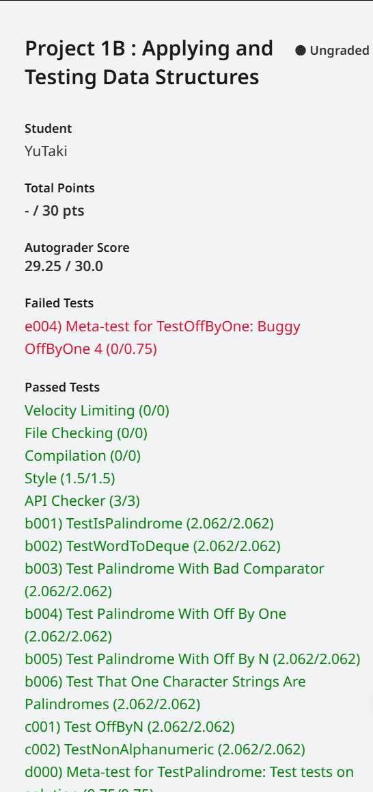

## 写在前面

本项目取自UCB CS61B SP18的Project1B，整体来说难度不大，主要是考察我们在已给出API的情况下完成任务，这或许是未来工作时很常见的工作流。本文章仅为笔者做题时的想法，如果存在错误或您有更好的想法，欢迎与我联系。

[点这里向我发邮件~](mailto:yutaki23@163.com)

## 具体思路

### Task 1: Deque Interface

本任务主要是要我们创建一个类，即1A中完成的链表，并通过继承、接口等向我们介绍了Java的特性。笔者为不引发歧义，在这里使用Josh教授的代码，而非自己实现的，如果你对自己的代码有信心，也欢迎直接复制。综上，整体步骤不难，跟着提示一步一步来即可。

```java
public interface Deque<Item> {
    public void addFirst(Item item);

    public void addLast(Item item);

    public boolean isEmpty();

    public int size();

    public void printDeque();

    public Item removeFirst();

    public Item removeLast();

    public Item get(int index);
}
```

```java
import java.util.LinkedList;
import java.util.NoSuchElementException;

public class LinkedListDeque<Item> extends LinkedList<Item> implements Deque<Item> {
    @Override
    public void printDeque() {
        System.out.println("dummy");
    }

    public Item getRecursive(int i) {
        return get(i);
    }

    @Override
    public Item removeFirst() {
        try {
            return super.removeFirst();
        } catch (NoSuchElementException e) {
            return null;
        }
    }

    @Override
    public Item removeLast() {
        try {
            return super.removeLast();
        } catch (NoSuchElementException e) {
            return null;
        }
    }
}
```

### Task 2: wordToDeque

本任务需要我们创建一个新类，其中包括一个新方法，即将一个字符串变成一系列字符，并用链表连接起来，并完成测试，简单的迭代。

```java
public class Palindrome {
    public Deque<Character> wordToDeque(String word) {
        Deque<Character> deque = new LinkedListDeque<>();
        for (int i = 0; i < word.length(); i++) {
            char currentWord = word.charAt(i);
            deque.addLast(currentWord);
        }
        return deque;
    }
}
```

### Task 3: isPalindrome

#### Task 3A: isPalindrome Testing

本任务需要我们编写测试，即判断一个字符串是否为回文，运用`assertTrue`和`assertFalse`来判断，以下为我编写的测试，可能与你写的不一样，无伤大雅。

```java
    @Test
    public void testIsPalindromeFalse() {
        assertFalse(palindrome.isPalindrome("cat"));
        assertFalse(palindrome.isPalindrome("abc"));
        assertFalse(palindrome.isPalindrome("Aa"));
    }

    @Test
    public void testIsPalindromeTrue() {
        assertTrue(palindrome.isPalindrome("a"));
        assertTrue(palindrome.isPalindrome("aba"));
        assertTrue(palindrome.isPalindrome("aa"));
        assertTrue(palindrome.isPalindrome(" "));
        assertTrue(palindrome.isPalindrome("redder"));
    }
```

### Task 3B: isPalindrome

本任务就需要我们具体实现这个方法了，思路为，一个字符串的字符数可能为奇数或偶数，只需要第一个与最后一个做判断，然后不断向中间靠拢即可，同时根据题意，还存在一个base case，即字符数为0或1的时候均判断为回文数，不难写出代码，

```java
    public boolean isPalindrome(String word) {
        int length = word.length();
        if (length != 0 && length != 1) {
            Deque<Character> deque = wordToDeque(word);
            for (int i = 0, j = deque.size() - 1; i < deque.size() / 2; i++, j--) {
                if (deque.get(i) != deque.get(j)) {
                    return false;
                }
            }
        }
        return true;
    }
```

### Task 4: Generalized Palindrome and OffByOne

在这里，题目向我们介绍了不仅有第一个字符与最后一个字符相同称为回文数，还存在其他类型的回文数，比如相差1位也被称为回文数，根据题目的顺序来写，不难写出，

```java
public class OffByOne implements CharacterComparator {
    @Override
    public boolean equalChars(char x, char y) {
        int diff = Math.abs(x - y);
        return diff == 1;
    }
}
```

```java
import org.junit.Test;
import static org.junit.Assert.*;

public class TestOffByOne {

    // You must use this CharacterComparator and not instantiate
    // new ones, or the autograder might be upset.
    static CharacterComparator offByOne = new OffByOne();

    // Your tests go here.
    @Test
    public void testEqualCharsTrue() {
        assertTrue(offByOne.equalChars('a', 'b'));
        assertTrue(offByOne.equalChars('r', 'q'));
        assertTrue(offByOne.equalChars('&', '%'));
    }

    @Test
    public void testEqualCharsFalse() {
        assertFalse(offByOne.equalChars('a', 'e'));
        assertFalse(offByOne.equalChars('z', 'a'));
        assertFalse(offByOne.equalChars('a', 'a'));
    }
}
```

```java
    public boolean isPalindrome(String word, CharacterComparator cc) {
        int length = word.length();
        if (length != 0 && length != 1) {
            Deque<Character> deque = wordToDeque(word);
            for (int i = 0, j = deque.size() - 1; i < deque.size() / 2; i++, j--) {
                if (!cc.equalChars(word.charAt(i), word.charAt(j))) {
                    return false;
                }
            }
        }
        return true;
    }
```

```java
    @Test
    public void testIsPalindromeWithCCFalse() {
        CharacterComparator cc = new OffByOne();
        assertFalse(palindrome.isPalindrome("ac", cc));
        assertFalse(palindrome.isPalindrome("ok", cc));
    }

    @Test
    public void testIsPalindromeWithCCTrue() {
        CharacterComparator cc = new OffByOne();
        assertTrue(palindrome.isPalindrome("ab", cc));
        assertTrue(palindrome.isPalindrome("flake", cc));
        assertTrue(palindrome.isPalindrome("%&", cc));
        assertTrue(palindrome.isPalindrome(" ", cc));
    }
```

### Task 5: OffByN

最后就要求我们更为通用的实现回文数了，主要包括一个构造函数与一个方法，与OffByOne没什么两样，具体实现如下，

```java
public class OffByN implements CharacterComparator {
    private int items;

    public OffByN(int N) {
        this.items = N;
    }

    public boolean equalChars(char x, char y) {
        int diff = Math.abs(x - y);
        return diff == this.items;
    }
}
```

```java
import org.junit.Test;
import static org.junit.Assert.*;

public class TestOffByN {
    static CharacterComparator offBy5 = new OffByN(5);
    static CharacterComparator offBy1 = new OffByN(1);

    @Test
    public void testEqualCharsFiveTrue() {
        assertTrue(offBy5.equalChars('a', 'f'));
        assertTrue(offBy5.equalChars('f', 'a'));
    }

    @Test
    public void testEqualCharsFiveFalse() {
        assertFalse(offBy5.equalChars('h', 'f'));
    }
}
```

**总的代码实现可以看我的[GitHub仓库](https://github.com/YuTaki23/CS61B-SP18/tree/main/proj1b)**



## 写在后面

总的来说并不难，比上一个1A好多了:(