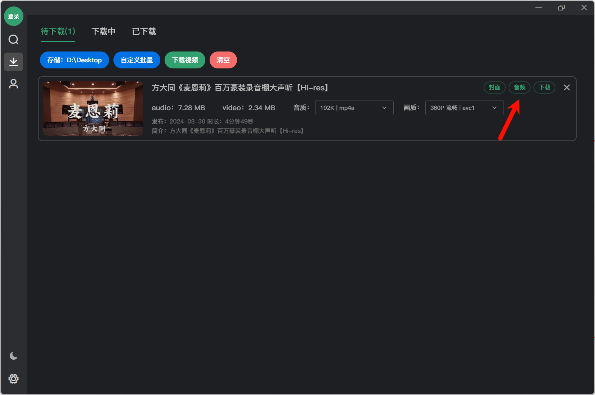
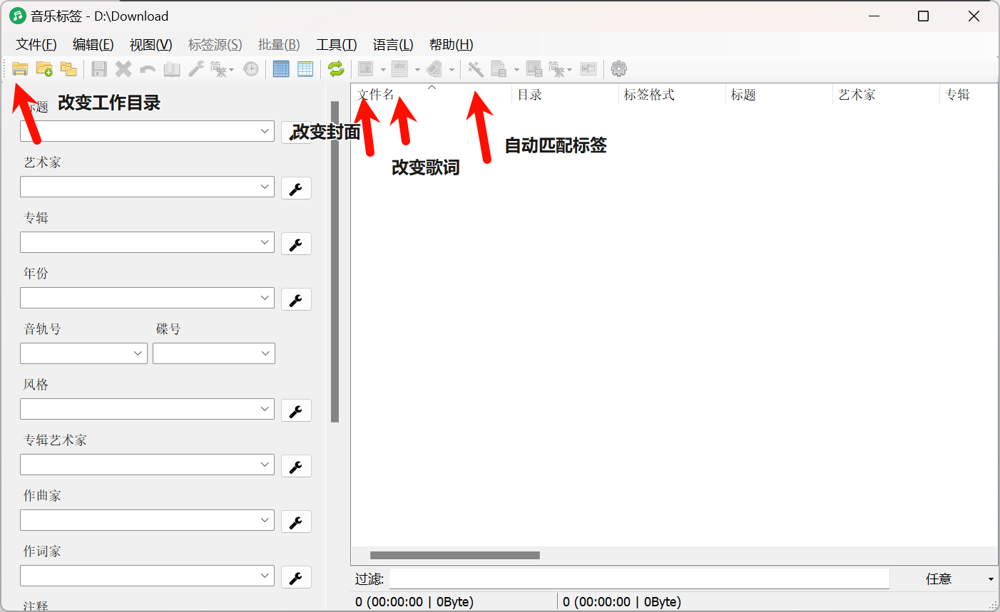

# [YuTaki] Make Life More Regular——听歌篇

## 一、写在前面

**让生活更有条理性。**

作为**Make Life More Regular**的第一篇内容，笔者选择了每天都会做的一件事——**听歌**。

你是否还在烦恼自己的歌怎么在平台上突然没有**版权**了？

你是否还在厌倦听歌时看着不同的人发着不同的“**emo文字**”？

本文章仅为笔者自己平时的听歌流，主要方式为将网络音乐下载到本地进行收听，本文章会主要讲解以什么方式下载以及更优雅的设置听歌方式。

**本文章仅代表笔者个人观点，主观性很强，一千个读者有一千个哈姆雷特。**

若本文章出现了什么错误或您有更好的想法，欢迎与我联系。

[点这里向我发邮箱~](mailto: yutaki23@163.com)

## 二、运行设备与主要应用

1. 操作系统：Android12 OriginOS
2. [Salt Palyer](https://moriafly.com/program/salt-player.html) 极其优秀的安卓本地音乐播放器，其简洁但不失重要功能深受笔者喜爱。
3. bilidown 一款简洁易下载哔哩哔哩视频的软件。应作者要求，在此不贴上软件地址，有需要的请自行寻找。
4. MusicTag 可将本地音乐的歌曲名、作者、专辑、歌词等信息作为元数据导入到歌曲中。在Salt Player中可以读取出来。

## 三、主要优点与缺点

### 优点

1. 长期存在。不用再担心自己的歌曲会被版权收掉，只要歌曲一直存在本地，只要硬盘不损坏，歌曲就不会有丢失的一天。
2. 简单干净的页面。不用在听歌的时候看网友所谓的“丧语录”。

### 缺点

1. 对新歌的感知弱。新歌发布后无法第一时间接收到消息，只能由他人推荐，或自己随缘找到。

## 四、操作步骤

1. **找到你喜欢的歌。**一般来说，大家喜欢听的歌都可以在互联网上找到，包括但不限于哔哩哔哩、抖音、YouTube等媒体播放网站。笔者在这里以哔哩哔哩和《麦恩莉》为例。将这首歌的网站复制下来，得到类似于这样的https://www.bilibili.com/video/BVxxxxxx/[^1]一个网站。
2. **下载歌曲。**打开bilidown。将网站复制进去，即可得到类似于这样的界面。随后点击**音频**按钮即可开始下载，注意到，可以提前将音质调为**192k**，这样音质会更好。之后，会调出下载界面，此处笔者建议统一将文件名改为**歌曲名-作者.m4a**，这都是为了之后添加歌曲信息时更加方便。
 

4. **将元数据导入到歌曲中。**打开MusicTag，会看到这些内容，作为使用了很长时间的人来说，我给出的建议是：
    - **改变工作目录。**将其改为你下载歌曲的文件夹。
    - **自动匹配标签**。全选你所下载的歌曲，让软件自动识别其标题、艺术家等内容。
    - **检查**。大致查看各元数据是否能对的上，如果不，单独找出来在左侧修改错误的内容，如果是封面错误，点击**改变封面**选择正确的封面，如果是歌词错误，点击**改变歌词**选择正确的歌词。笔者的经验是，如果一首歌的封面错误，那大概率歌词也有错，其他信息大概率都有错。最后不要忘记右键保存。

4. **将歌曲传到手机上。**笔者的建议为在手机上创建一个**Music**文件夹，用来专门存放下载的歌曲。打开**Salt Player**，点击左上角，左侧会出现**扫描音乐**选项，使用自定义文件夹，将其设置为下载歌曲的文件夹，点击**开始扫描**。

5. **Congratulation!**此时，你就可以发现，你的歌曲已经到了Salt Player里面，并且标题、作者、专辑、封面等内容应有尽有。

## 五、写在后面

大致的操作步骤就这些，有关这些应用的其他进阶操作，欢迎各位自己摸索。

最后，感谢每一位创建这些软件的作者，希望大家尊重开源，享受开源。**开源世界有你更精彩。**

## 六、相关问题

**问：**我只能使用各大网站下载的歌曲吗？

**答：**当然不，如果你能找到**Flac**等更高级的格式当然是最好不过，但请不要在手机上直接下载听歌软件上的歌曲，大部分都有加密，过了VIP期限后就无法再听了。

**问：**为什么后缀一定要改成**m4a**的格式，改成其他的不行吗？

**答**：根据笔者尝试，使用**mp3**格式时会在将元数据导入歌曲中出现问题，其他格式还没有尝试过，有尝试过的朋友可以补充。

**问**：为什么要在手机上创建一个新的文件夹？

**答**：现在人的手机上大概率会有录音等其他非歌曲内容，Salt Player在识别的时候会将这些内容也识别为歌曲，而创建一个文件夹就可以让Salt Player只识别当前文件夹的内容。

[^1]: 此网站非正确网站，在此仅为示例，替换成你所找到的歌曲的网站即可。